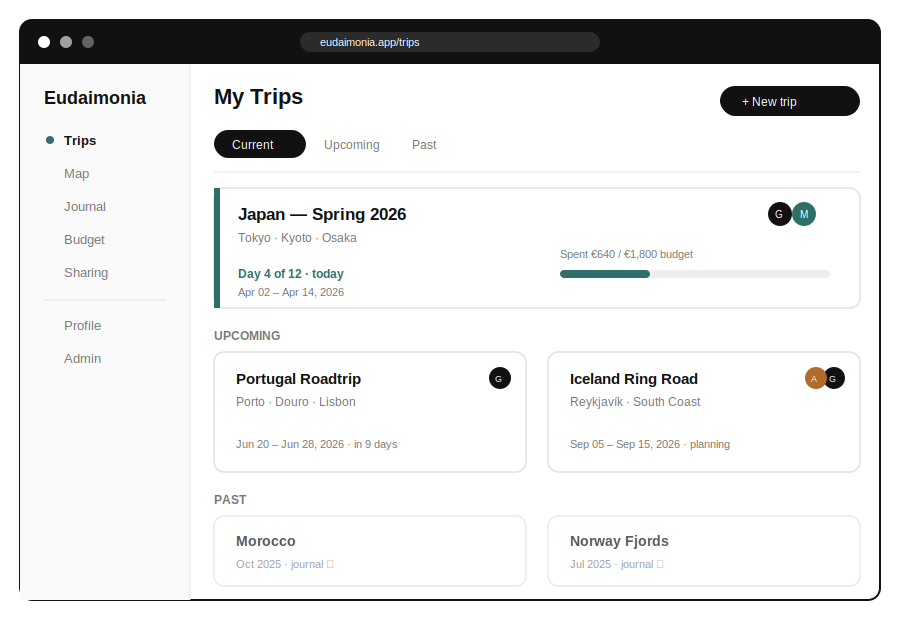
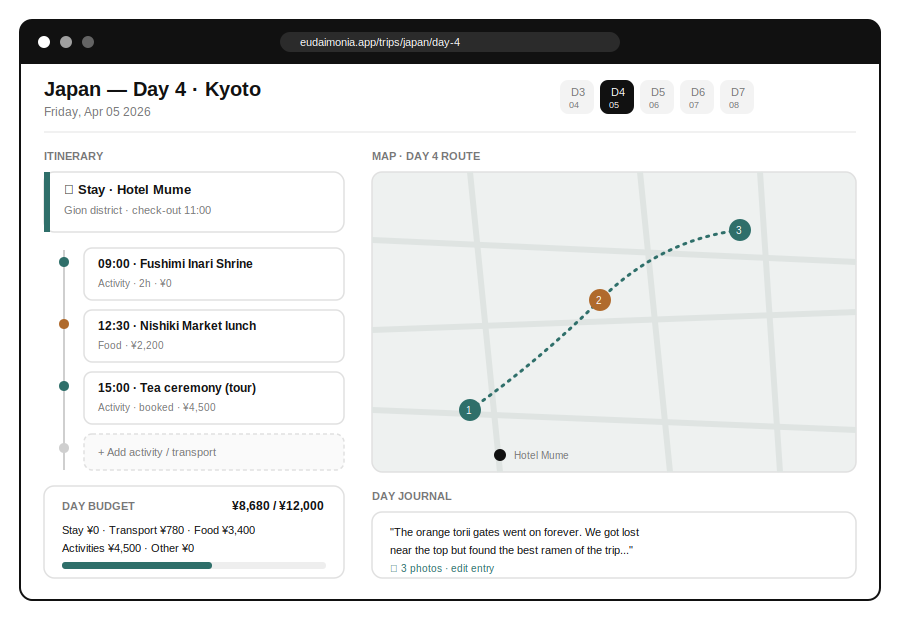
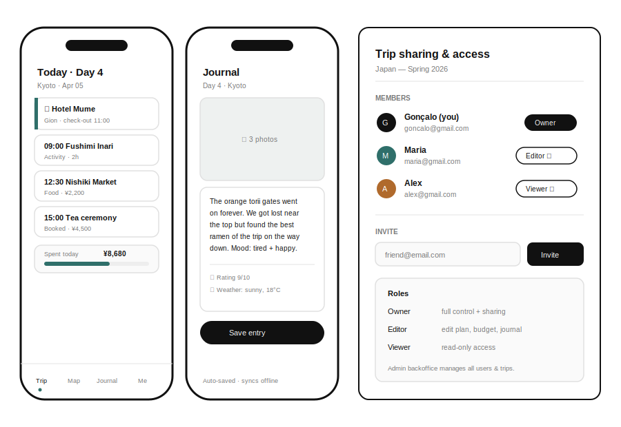
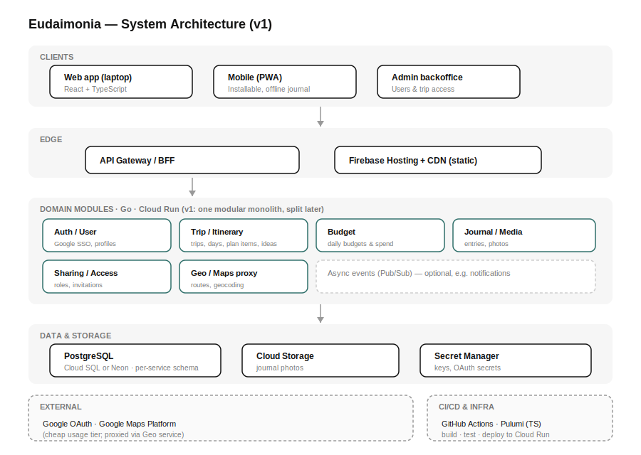

# Eudaimonia — Travel Manager
### Product Requirements Document · v1 (First Release)

**Author:** Gonçalo Mestre
**Date:** 2026-06-11
**Status:** Draft for epic breakdown

---

## 1. Summary

Eudaimonia is a personal travel-management app that replaces and upgrades the spreadsheet the author currently uses to plan and record trips. It lets a traveller plan a trip day-by-day (where to stay, what activities/tours to take, daily budgets), keep a daily journal, see each day's plan on a map, and share a trip with travel companions through granular access control.

The product ships as a **responsive web app** (laptop) and an **installable mobile experience (PWA)** from a single React/TypeScript codebase, backed by a **Go backend** on GCP. Planning is **organic and easy to change on the fly** — loose ideas or precise schedules, freely re-arranged mid-trip. The stack is kept **deliberately small and easy to maintain** (§7.0). The visual style is minimal: **black & white as the primary theme**, with restrained accent colour only where it adds clarity (status, maps, budget).

> **Why "v1"?** This document scopes the *first shippable version*. It is intentionally complete on features but pragmatic on engineering, so it can be split cleanly into epics and work packages. Section 10 lists what is explicitly deferred.

---

## 2. Goals & Non-Goals

### Goals
- Replace the author's current Excel workflow with a faster, nicer, more capable tool.
- One place to **plan**, **budget**, **navigate**, and **journal** a trip — before, during, and after.
- **Plan organically** — capture loose ideas *and* precise schedules, and **re-plan effortlessly mid-trip** so spontaneity is a first-class behaviour, not an exception.
- **Track costs against budget** so the author always knows where they stand, by day, category, and trip.
- Usable and pleasant **on a phone while travelling** (including weak/no connectivity for journaling and quick changes).
- **Share trips** with friends/partners at the right permission level.
- Run on a **minimal, low-maintenance, easy-to-change** stack the author can keep alive for years with little effort (see §7.0).

### Non-Goals (v1)
- Not a booking engine — we **link out** to bookings, we don't sell flights/hotels.
- No payments, no expense splitting/settlement between friends (budgets are personal tracking).
- No social feed / public trip sharing.
- No AI itinerary generation (candidate for a later version).
- No native iOS/Android app store builds (PWA covers mobile in v1).

---

## 3. Target Users & Roles

| Persona | Description | Needs |
|---|---|---|
| **Traveller (owner)** | The author and similar power-users migrating from spreadsheets. | Plan trips in depth, track budgets, journal, share with companions. |
| **Companion** | A friend/partner invited to a specific trip. | View or co-edit a shared trip — nothing else. |
| **Admin** | Operator of the app (initially the author). | Manage users and which trips they can access via a backoffice. |

**Access roles on a trip:** `Owner` (full control + sharing), `Editor` (edit plan/budget/journal), `Viewer` (read-only). A platform-level **Admin** role exists above trips for user/trip management.

---

## 4. Concept Mockups

These are **directional concepts**, not final designs — they illustrate scope and the minimal black/white aesthetic.

**4.1 — Trips dashboard (Current / Upcoming / Past)**



**4.2 — Day plan with itinerary, accommodation, activities, daily budget, and map**



**4.3 — Mobile day view, mobile journal, and trip sharing / access control**



---

## 5. Functional Requirements

### 5.1 Trips & navigation
- A **Trips menu** that groups trips into **Current**, **Upcoming**, and **Past** (derived automatically from dates vs. today).
- "Current trip" surfaces prominently (it's the day-to-day driver while travelling), showing today's day number and budget progress.
- Create / edit / archive / delete a trip. A trip has: name, destinations, start & end date, cover, and members.
- A trip auto-generates one **Day** per date in its range; days can be reordered conceptually but map to real calendar dates.

### 5.2 Per-day planning (organic & flexible)
Planning is **loose by default and precise when wanted** — the plan is a helpful guide, not a rigid schedule. For **each day of a trip**, the traveller can define:
- **Accommodation / stay** — where they sleep that night (name, location, check-in/out, link, cost). A multi-night stay can span days without re-entering it.
- **Plan items (activities, tours, ideas, transport)** — a flexible list where each item can be:
  - **Untimed** — just an idea or a "maybe" ("visit the old town", "try a ramen place"), with no time attached; **or**
  - **Timed / scheduled** — with a start time (and optional duration) when something is fixed or booked.
  - Items carry: title, optional time, type, optional location, booking status, link, and cost — **all optional except a title**, so capturing an idea is one tap.
- **Ideas / backlog** — a per-trip (or per-day) **parking lot** of unscheduled ideas the traveller can pull into a day whenever they decide to do them.
- **Notes** — free text for the day.
- A **day view** that shows timed items in order and untimed ideas as a simple loose list (see 4.2) — never forcing a time where there isn't one.

### 5.3 Re-planning & spontaneity (first-class)
Spontaneous changes must be **fast and frictionless**, especially on mobile mid-trip:
- **Reorder** items within a day and **move** an item to another day with a quick gesture (drag, or a "move to day" action).
- **Promote an idea to a plan** (and back) without re-entering it; **mark items done, skipped, or cancelled** so the day reflects what actually happened.
- **Edit or add anything inline** in a couple of taps — adding a spontaneous activity should be as easy as journaling.
- Changes are **auto-saved** and sync (offline-capable, §6) so re-planning works with poor connectivity.
- The plan is a living record: by the end of a trip it doubles as a log of what was actually done, feeding naturally into the journal.

### 5.4 Budgets & cost tracking
- Set **budgets** per category — **Stays, Transport, Food, Activities, Other** — at the **trip level and/or per day**.
- **Track actual spend against budget**: each stay/activity cost rolls up automatically, and quick **manual cost entries** can be added on the go (e.g. a spontaneous lunch).
- See **remaining vs. spent vs. planned** at a glance, with a simple progress indicator, rolled up **per day, per category, and per whole trip**.
- Designed for in-trip use: logging a cost should be as fast as adding a plan item, so the budget stays accurate while travelling.
- Single trip **base currency** in v1 (multi-currency is deferred — see §10).

### 5.5 Daily journal
- A fast, low-friction **journal entry per day**: free text, optional rating, weather/mood, and **photos**.
- **Auto-save** and **offline-capable** on mobile (entries sync when back online) — journaling often happens with poor connectivity.
- Past trips keep their journals as a permanent record.

### 5.6 Map
- A **map per day** showing the day's stay, activities, and transport as pins, in itinerary order, with an indicative route between them.
- Tapping a pin highlights the matching itinerary item (and vice-versa).
- Built on **Google Maps Platform** (the author has a GCP project), accessed through a backend proxy to protect keys and control cost.

### 5.7 Profile
- Basic profile: name, avatar, home base, default currency, preferences (e.g., theme).
- Managed by the user; editable from web and mobile.

### 5.8 Authentication & user management
- **Sign-in with Google (SSO / OAuth)** is the only auth method in v1 — no passwords to manage.
- First sign-in provisions a user record and an empty profile.

### 5.9 Sharing & backoffice
- From a trip, the owner can **invite a companion by email** and assign a role (Editor/Viewer); see 4.3.
- Invited users see **only** the trips shared with them.
- An **Admin backoffice** (separate, minimal surface) lets the admin: list users, list trips, and manage **who can access which trip** (grant/revoke, change role), and deactivate users.
- All trip data access is enforced **server-side** by the Sharing/Access service — the UI never decides authorization on its own.

### 5.10 UI / UX requirements
- **Minimal black & white theme** as the default. Accent colour used sparingly for status, budget bars, and map pins. Other colours acceptable in supporting/illustrative areas.
- **Simple, uncluttered** layouts; few primary actions per screen.
- **Responsive**: a comfortable laptop layout and a genuinely usable mobile layout (bottom nav, thumb-reachable actions) — not a shrunk desktop.
- Accessible: keyboard navigation, sufficient contrast, readable type.
- Designed to evolve: the team will **iterate on real user feedback** after v1 — components and theming should be easy to tweak.

---

## 6. Non-Functional Requirements

| Area | Requirement |
|---|---|
| **Availability** | Must be reliable while the author is travelling abroad. Target ~99.5% for the API; graceful read-only/offline behaviour on the client when the network is poor. |
| **Performance** | Day view interactive in < 1.5s on a mid-range phone on 4G. |
| **Offline** | Journal and current-trip viewing work offline on mobile; writes queue and sync. |
| **Security** | OAuth-only auth; server-side authorization on every request; secrets in Secret Manager; least-privilege service accounts. |
| **Privacy** | Personal data (trips, photos, journals) visible only to the owner and explicitly invited members. |
| **Cost** | Personal project — must be cheap at idle (scale-to-zero) while staying reliable. See §8. |
| **Observability** | Centralised logs, basic metrics, and error alerting so issues abroad are noticed. |
| **Quality** | Unit tests, integration tests, and end-to-end tests required across services and frontend (see §7.6). |

---

## 7. Architecture & Engineering Decisions

> These decisions are **recorded here for the epic breakdown**; we are not implementing them in this document. Where a choice needs justification (database, deployment), the reasoning is included so it can be challenged later.



### 7.0 Guiding principle — minimal & maintainable (overrides the rest)
This is a **personal project that must survive years on low effort**. Every choice below is governed by one rule:

> **Keep the tech stack as small as possible and keep decisions easy to reverse.**

In practice that means:
- **Fewest moving parts that get the job done.** Prefer one boring, well-understood tool over several clever ones. Add a new technology only when an existing one genuinely can't cover the need.
- **One language per layer, reused everywhere** — Go on the backend, TypeScript for frontend + scripting + infra. No extra languages or runtimes.
- **Lean on managed, scale-to-zero services** so there's little to operate or patch (no self-hosted databases, queues, or clusters).
- **Clean internal boundaries over premature distribution** — structure the domain so pieces *can* be split later, but don't pay the cost of many deployables until there's a real reason.
- **Easy to change:** isolate third-party dependencies (maps, auth, storage) behind thin internal interfaces so any one of them can be swapped without rewrites.

Where this principle tensions with a stated decision (e.g. "microservices"), §7.0 wins on *how much* to build now — see §7.1.

### 7.1 Backend — Go, microservice-ready but minimal first
- Backend is written in **Go**, designed around a **microservice architecture** as the **target shape**.
- **v1 default: a modular monolith** (a single Go service with clean, independently-testable internal modules along the boundaries below), or at most **2–3 deployables**. This honours the microservice domain design while keeping operations, cost, and cognitive load minimal — fully in line with §7.0. Modules can be peeled off into their own services later **without changing the domain model**.
- Target module / service boundaries:
  1. **Auth / User** — Google SSO, sessions/tokens, profile.
  2. **Trip / Itinerary** — trips, days, stays, plan items (timed & untimed), ideas backlog.
  3. **Budget** — budgets and actual costs, roll-ups.
  4. **Journal / Media** — journal entries and photo handling.
  5. **Sharing / Access** — membership, roles, invitations, authorization.
  6. **Geo / Maps proxy** — geocoding, routing, key protection for Google Maps.
- Clients talk to a single clean API (a thin **BFF/gateway** only if/when more than one deployable exists).
- **Third-party integrations** (Google Maps, Google OAuth, object storage) sit behind **thin internal interfaces** so they can be swapped cheaply (§7.0).

### 7.2 Frontend — React + TypeScript
- Web app and mobile experience share one **React + TypeScript** codebase.
- **Mobile = responsive + PWA** (installable, offline-capable) in v1; a native app is a later decision, not a v1 commitment.
- Component library/design tokens chosen to make the **black/white theme** and future restyling easy.

### 7.3 Scripting & tooling — TypeScript
- All **scripting is TypeScript** (build helpers, data migration from the existing Excel, seed scripts, ops scripts).

### 7.4 Infrastructure as Code — TypeScript
- **Infrastructure defined in TypeScript** using **Pulumi** (or CDK for Terraform) targeting GCP. This satisfies "infrastructure can be in TypeScript" and keeps one language across infra + scripting.

### 7.5 CI/CD — GitHub Actions
- **GitHub Actions** in the author's GitHub repository.
- Pipeline per change: lint → unit tests → build → integration tests → (on main) deploy to GCP, plus e2e tests against a preview/staging environment.

### 7.6 Testing strategy
- **Unit tests** mandatory for every service and frontend module.
- **Integration tests** for service-to-service and service-to-database behaviour.
- **End-to-end tests** for the critical user journeys (sign in → create trip → plan a day → add budget → write journal → share trip), runnable in CI.

### 7.7 Database — **decision: PostgreSQL (SQL)**
This was called out for a well-founded SQL-vs-NoSQL decision. **Recommendation: PostgreSQL.**

**Why the data is fundamentally relational:**
- The domain is a graph of clear, stable entities with strong relationships: `User → Trip → Day → {Stay, Activity, BudgetLine, JournalEntry}`, plus `TripMembership(User, Trip, Role)`.
- Core features need **multi-entity consistency and joins**: budget roll-ups (sum activity/stay costs per day, category, and trip), and **authorization** (does this user have a role on this trip?). These are natural relational queries and benefit from transactions and foreign-key integrity.
- Access control is safety-critical; **referential integrity** and transactional updates reduce the chance of orphaned or over-shared data.

**Why not document/NoSQL (e.g. MongoDB):**
- A document model would tempt us to embed days/activities inside a trip document; that fights cross-cutting queries (budgets across a trip, "all trips a user can see", admin reporting) and complicates partial updates and sharing.
- We don't have the write-scale or schema-fluidity pressures that justify NoSQL for a personal app.

**Keeping flexibility within Postgres:**
- Use **JSONB columns** for genuinely semi-structured bits (journal rich content, activity metadata) — we get document-style flexibility *and* relational integrity in one engine.
- **PostGIS** is available if/when we want richer geo queries.
- **One database, schema-per-module.** Each domain module owns its own schema/tables (logical separation now), so a module can later move to its own service/database without a data redesign — keeping the door open without paying for it today (§7.0).

### 7.8 Hosting & deployment — **cheap, reliable, on GCP**
The author wants something **cheap but reliable while abroad**, and already has a **GCP project**.

**Recommendation:**
- **Backend services → Google Cloud Run.** Containers that **scale to zero** (≈€0 at idle), scale up on demand, fully managed, regional reliability. Ideal cost/reliability fit for a personal project.
- **Frontend (static) → Firebase Hosting + CDN** (generous free tier, global CDN, easy custom domain) — or Cloud Storage + Cloud CDN as an alternative.
- **Database → Neon (serverless Postgres), starting on the free tier. _(Decided.)_** Scales to zero (€0 at idle) and, crucially, **upgrades to a paid tier with a single click and no data migration** — which is what makes mid-trip scale-up possible (see §8.6). Cloud SQL was the alternative but it doesn't scale to zero and is slower to resize, so it loses on both the "start at €0" and "scale up instantly while abroad" goals.
- **Photos → Cloud Storage.** **Secrets → Secret Manager.** **Optional async (notifications) → Pub/Sub.**
- **Maps → Google Maps Platform** within free monthly credit, proxied via the Geo service to control spend.

**Cost posture:** at idle the stack should cost only the database (a few €/month at most) plus negligible storage — everything else scales to zero. This is the cheapest reliable shape for a personal, occasionally-bursty travel app.

---

## 8. Cost Estimates (running the project)

> **Assumptions:** single-digit users (the author + a few companions), a few trips/month, modest photo volumes, EUR approximate, prices as of mid-2026. Cloud pricing changes — treat as planning figures, not quotes. Everything except the database **scales to zero**, so cost tracks usage closely.

### 8.1 Per-component monthly estimate

| Component | Service | Free allowance | Expected cost (this app) |
|---|---|---|---|
| Backend compute | **Cloud Run** | 2M req, 360k GB-s, 180k vCPU-s / mo | **€0** (well within free tier) |
| Frontend hosting | **Firebase Hosting + CDN** | 10 GB stored, ~10 GB/mo transfer | **€0** |
| Database | **Neon (serverless PG)** *free* | 0.5 GB, scale-to-zero | **€0** (build/light use) |
| Database *(alt, reliable)* | **Neon Launch** *or* **Cloud SQL micro** | — | **€10–18** (steady; doesn't scale to zero) |
| Photo storage | **Cloud Storage** | 5 GB Standard | **€0–1** (a few GB of photos) |
| Secrets | **Secret Manager** | 6 active versions, 10k access ops | **€0** |
| Container images | **Artifact Registry** | 0.5 GB | **€0–0.5** |
| Maps | **Google Maps Platform** | free monthly call allowance per SKU | **€0** at low use (see risk §8.4) |
| CI/CD | **GitHub Actions** | 2,000 min/mo (private) · unlimited (public) | **€0** |
| Logs/metrics | **Cloud Logging/Monitoring** | 50 GB logs/mo | **€0** |
| Transactional email (invites) | e.g. **Resend/Brevo** free tier | ~3k emails/mo | **€0** |
| Domain name | registrar | — | **~€1** (≈ €10–15/year) |

### 8.2 Realistic monthly scenarios

| Scenario | What it buys | Est. / month |
|---|---|---|
| **A — Max free tier (build & light use)** | Neon free DB, everything else on free tiers. Trade-offs: DB cold starts, 0.5 GB cap, less headroom. | **~€1–3** |
| **B — Reliable-while-travelling (recommended)** | Paid managed DB you trust (Neon Launch ~€18 or Cloud SQL micro ~€10) for consistent performance + backups, small buffer for storage/maps. | **~€12–25** |
| **C — If it grows (more companions, more photos)** | Larger DB tier, more storage/egress, some Maps usage. | **~€30–50** |

### 8.3 One-time & annual costs
- **Domain:** ~€10–15 / year.
- **No upfront infrastructure cost** — all pay-as-you-go.
- **Google Maps & GCP require billing enabled** (a card on file) even while usage stays within free allowances.

### 8.4 Cost drivers & risks to watch
1. **Database is the only real steady cost.** It's the main lever: free Neon = €0 but with cold starts/limits; a paid tier (~€10–18) buys reliability. Pick based on whether you're mid-trip-dependent.
2. **Google Maps overage is the biggest *variable* risk** — and a leaked/unrestricted key is the classic surprise bill. Mitigate: proxy all Maps calls through the Geo service, **restrict the API key**, **cache map loads**, and set **hard quotas + a billing alert** (§8.5).
3. **Photo egress/storage** — large photos viewed often add bandwidth. Mitigate with server-side **resizing/thumbnails**.
4. **CI minutes** — heavy e2e runs can exceed the 2,000 free GitHub Actions minutes on a *private* repo; keep the repo public or watch minutes.

### 8.5 Financially-responsible defaults (recommended actions)
- **Set a GCP billing budget + alert on day one** (e.g. €25/mo) and **hard quota caps on the Maps API**. This single step prevents nearly all bill surprises.
- **Start on Scenario A** (effectively free) during build and early use.
- **Upgrade the database to a paid tier before depending on it during a real trip** (Scenario B) — buy reliability exactly where it matters.
- **Never ship the Maps/OAuth keys to the client** — proxy via the Geo service; restrict and rotate keys.
- **Review billing monthly** for the first few months, then quarterly.

**Bottom line:** expect **≈€0–3/month while building**, **≈€12–25/month once you want it dependable abroad**, with the database being the one knob that matters and Google Maps the one risk to cap.

### 8.6 Run-at-€0, scale-up-on-demand plan _(Decided)_

**Goal:** run at **€0/month** by default and pay only when a real limit is hit — including the ability to **scale up mid-trip, from a phone, in minutes**.

**Phase 0 — Free by default (steady state).** Everything on free tiers: Cloud Run (scale-to-zero), Firebase Hosting, **Neon free Postgres** (scale-to-zero), Cloud Storage, Maps within free allowance. Target bill: **€0** (just the domain, ~€1/mo).

**Phase 1 — Scale only the thing that's constrained.** Each component scales independently, so a limit on one never forces paying for the rest:

| Watch this signal | Means you're hitting | Scale-up action | Effect on bill |
|---|---|---|---|
| DB storage nearing the free cap (~0.5 GB) | Photos/data growth | Click Neon → paid tier (more storage), or move photos fully to Cloud Storage | +~€10–18/mo |
| DB cold-start / latency hurting UX | Scale-to-zero wake delay | Enable Neon "always-on" / paid compute | +~€10–18/mo |
| Slow API or request throttling | Cloud Run cold starts | Set Cloud Run **min-instances = 1** | +~a few €/mo |
| Maps calls approaching free allowance | More map usage | Raise the Maps quota cap (kept low by default) | pay-per-use |
| Storage/egress growth | Lots of large photos | Add thumbnailing; raise storage | cents–€1s |

**Pre-requisites that make this work (build into v1 so scaling is just a setting, never a rewrite):**
- Use Neon's **connection pooler / serverless driver** from day one, so going from scale-to-zero to always-on (or back) is a config change, not a code change.
- Keep all tunables — Cloud Run min-instances, DB tier, Maps quota — as **infra config (Pulumi/TS) _and_ dashboard-toggleable**, so they can be changed without a deploy.
- Keep the **GCP/Neon dashboards reachable from mobile** and the billing alert active, so you can react from anywhere.

**Mid-trip playbook (the "scale up while I'm away" case):**
1. **Before a big/important trip (optional):** pre-emptively flip Neon to a paid tier and set Cloud Run min-instances = 1 for the trip; flip both back afterwards. A planned ~€10–20 for one month buys worry-free reliability.
2. **If something degrades *during* the trip:** open the Neon (or GCP) dashboard on your phone → bump the DB tier / enable always-on. **No migration, no redeploy, effect in minutes.**
3. **After the trip:** scale back down to free tier to return to €0.

This keeps the **default cost at €0**, makes **every scale-up a reversible single setting**, and guarantees you're **never stuck on a slow app abroad** with no way to fix it.

---

## 9. High-Level Data Model (for epic planning)

```
User(id, google_sub, email, name, avatar, home_base, default_currency, prefs, is_admin)
Trip(id, owner_id, name, destinations, start_date, end_date, base_currency, cover, status)
TripMembership(id, trip_id, user_id, role)            // Owner | Editor | Viewer
Day(id, trip_id, date, index, notes)
Stay(id, trip_id, name, location, check_in, check_out, cost, link)   // can span multiple days
PlanItem(id, trip_id, day_id?, title, type, start_time?, duration?,  // day_id null = idea/backlog
         location?, booking_status?, cost?, link?, order, status)    // start_time null = untimed
         // status: idea | planned | done | skipped | cancelled
BudgetLine(id, trip_id, day_id?, category, planned_amount, actual_amount)  // day_id null = trip-level budget
CostEntry(id, trip_id, day_id?, plan_item_id?, category, amount, note, created_at) // quick manual spend
JournalEntry(id, day_id, author_id, body, rating, weather, mood, created_at)
Photo(id, journal_entry_id, storage_url, caption)
Invitation(id, trip_id, email, role, status, token)
```

Categories: `Stays, Transport, Food, Activities, Other`.
Notes: a **PlanItem** with `day_id = null` is an unscheduled **idea** in the backlog; `start_time = null` is an **untimed** item within a day. Promoting an idea = setting its `day_id` (and optionally `start_time`); moving between days = changing `day_id`. Actual spend = sum of related `Stay`/`PlanItem` costs **plus** ad-hoc `CostEntry` rows, tracked against `BudgetLine`.

---

## 10. Out of Scope / Future (post-v1)

- Multi-currency per trip with live FX; expense splitting between companions.
- AI-assisted itinerary suggestions and auto-budgeting.
- Native iOS/Android apps (beyond PWA).
- Importer from the existing Excel (nice-to-have; could be an early TS script).
- Public/shareable read-only trip links; notifications (email/push) for shared-trip changes.
- Offline maps / downloadable day packs.

---

## 11. Open Questions

1. **Companion editing model** — for v1, is `Editor` enough, or do we need per-section permissions (e.g. budget hidden from companions)?
2. ~~**Database host**~~ — **Resolved:** start on **Neon free tier**, scale up on demand (§7.8, §8.6).
3. **Service granularity at launch** — confirm the §7.0 default (start as a **modular monolith**, split later) vs. building separate services up front. Recommendation: modular monolith.
4. **Photo limits** — any per-trip storage cap to keep Cloud Storage costs predictable?
5. **Currency** — confirm single base currency is acceptable for v1.

---

## 12. Suggested Epic Seeds (preview of next step)

Not part of scope definition — just a hint at how this PRD slices up:

1. **Foundations** — repo, CI/CD (GitHub Actions), IaC (Pulumi/TS), Cloud Run + DB skeleton, observability.
2. **Auth & Profile** — Google SSO, user provisioning, profile.
3. **Trips & Days** — trip CRUD, Current/Upcoming/Past menu, auto-generated days.
4. **Organic Day Planning** — stays, plan items (timed & untimed), ideas backlog, inline editing, drag-reorder / move-to-day, item statuses.
5. **Budgets & Cost Tracking** — trip/day budgets, automatic + manual cost entries, spent-vs-budget roll-ups.
6. **Journal & Media** — entries, photos, offline sync.
7. **Maps** — Geo proxy + per-day map.
8. **Sharing & Backoffice** — memberships, invitations, roles, admin surface.
9. **Design System & Mobile/PWA polish** — black/white theme, responsive + installable, accessibility.
10. **Testing & Hardening** — e2e journeys, load/cost review, security review.
```
